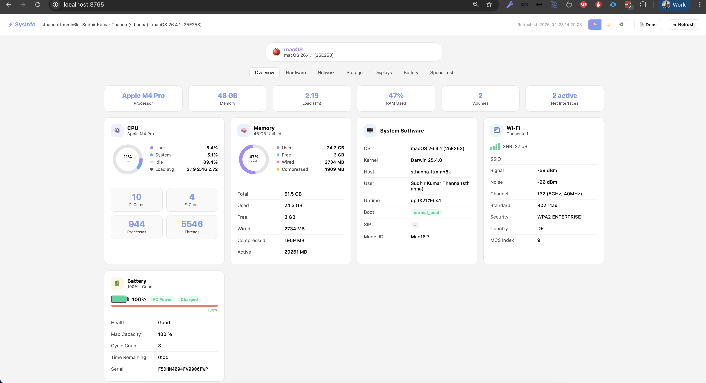

# SysInfo Dashboard

A live, cross-platform system information dashboard built with Python + vanilla HTML/CSS/JS.
No dependencies beyond Python 3's standard library.



---

## Project Structure

```
claude/
├── system-info-server.py   # Python HTTP server + all OS data-collection logic
├── system-info.html        # Single-page dashboard UI (served by the server)
└── README.md               # This file
```

---

## How It Works

```
Browser  ──GET /──►  system-info-server.py  ──serves──►  system-info.html
Browser  ──GET /api/sysinfo──►  sysinfo()  ──returns──►  JSON payload
Browser  ──GET /api/speedtest──►  run_speedtest()  ──returns──►  JSON result
```

1. `system-info-server.py` starts a plain `http.server.HTTPServer` on port 8765.
2. On every `GET /api/sysinfo` request it calls OS-specific collector functions, assembles a JSON blob, and returns it.
3. The browser-side JavaScript in `system-info.html` fetches that JSON, then renders all cards/charts dynamically.
4. Theme preference (dark/light/system) is stored in `localStorage`.
5. If opened as a plain file (no server), the page falls back to static demo data.

---

## Quick Start

```bash
python3 system-info-server.py
# Opens http://localhost:8765 automatically
```

Stop with `Ctrl+C`.

### Endpoints

| Path | Description |
|------|-------------|
| `GET /` | Dashboard UI |
| `GET /api/sysinfo` | Full system info as JSON |
| `GET /api/speedtest` | Run speed test (~30 s), returns JSON |
| `GET /readme` | This README rendered in-browser |

---

## Supported Operating Systems

| OS | Hardware | CPU/RAM | Battery | Wi-Fi | Storage | Network |
|----|----------|---------|---------|-------|---------|---------|
| **macOS** | ✅ `system_profiler` | ✅ `vm_stat`, `top` | ✅ `pmset` | ✅ SPAirPortDataType | ✅ SPStorageDataType | ✅ `netstat`, `ifconfig` |
| **Linux** | ✅ `/proc`, `/sys/class/dmi` | ✅ `/proc/meminfo` | ⚠️ basic | ❌ | ✅ `df` | ✅ `ip` |
| **Windows** | ✅ `Win32_ComputerSystem` | ✅ `Win32_OperatingSystem` | ✅ `Win32_Battery` | ❌ | ✅ `Win32_LogicalDisk` | ✅ `Win32_NetworkAdapterConfiguration` |

---

## Server — `system-info-server.py`

### Top-level constants

| Name | Value | Purpose |
|------|-------|---------|
| `PORT` | `8765` | HTTP listen port |
| `DIR` | `dirname(__file__)` | Directory of the script (used to find `system-info.html`) |
| `OS` | `platform.system()` | `'Darwin'`, `'Linux'`, or `'Windows'` |

### Helper functions

| Function | Description |
|----------|-------------|
| `run(cmd, timeout)` | Run a subprocess, return stdout as string, never raises |
| `run_ps(cmd)` | Run a PowerShell command (Windows only) |
| `sp_json(*types)` | Call `system_profiler -json <types>` and parse result |
| `b2gb(bytes)` | Convert bytes → GB (1 decimal) |
| `mb2gb(mb)` | Convert MB → GB |

### macOS collectors

| Function | Data source | Returns |
|----------|-------------|---------|
| `macos_cpu()` | `top -l 2` | `{user, sys, idle, load[], processes, threads}` |
| `macos_memory()` | `vm_stat`, `sysctl hw.memsize` | `{total_gb, used_gb, free_gb, wired_mb, active_mb, …}` |
| `macos_battery()` | `SPPowerDataType`, `pmset -g batt` | `{present, charge_pct, charging, health, cycle_count, …}` |
| `macos_wifi()` | `SPAirPortDataType` | `{connected, ssid, channel, phy_mode, signal, snr, nearby[]}` |
| `macos_network_interfaces()` | `networksetup`, `ifconfig`, `ipconfig` | List of interface objects |
| `macos_connections()` | `netstat -an -p tcp` | `(connections[], listening[])` |
| `macos_interface_stats()` | `netstat -ib` | Bytes in/out per interface |
| `macos_storage()` | `SPStorageDataType` | List of volume objects |
| `macos_displays()` | `SPDisplaysDataType` | List of display objects |
| `macos_thunderbolt()` | `SPThunderboltDataType` | List of Thunderbolt bus objects |
| `macos_network_meta()` | `route -n get default`, `scutil --dns` | `{gateway, dns[], domains[]}` |
| `macos_sysinfo()` | All of the above | Master payload dict |

### Linux collectors

All Linux data is read from `/proc` and `/sys` pseudo-filesystems or standard CLI tools (`ip`, `df`, `xrandr`).

| Function | Data source |
|----------|-------------|
| `linux_sysinfo()` | `/proc/cpuinfo`, `/proc/meminfo`, `/proc/uptime`, `/proc/loadavg`, `/etc/os-release`, `ip`, `df`, `xrandr` |

### Windows collectors

All Windows data comes from PowerShell `Get-CimInstance` WMI queries.

| WMI Class | Used for |
|-----------|----------|
| `Win32_ComputerSystem` | Model, RAM, hostname |
| `Win32_OperatingSystem` | OS version, free memory |
| `Win32_Processor` | CPU name, core count |
| `Win32_BIOS` | Serial number, firmware |
| `Win32_LogicalDisk` | Storage volumes |
| `Win32_VideoController` | Display info |
| `Win32_NetworkAdapterConfiguration` | Network adapters |
| `Win32_Battery` | Battery status |

### Speed test — `run_speedtest()`

Calls `networkQuality -c -s` (macOS 12+), parses the JSON summary line.

| Output field | Meaning |
|---|---|
| `dl_mbps` | Download throughput in Mbps |
| `ul_mbps` | Upload throughput in Mbps |
| `responsiveness` | RPM (Round-trips Per Minute) |
| `base_rtt_ms` | Base round-trip time in ms |

### HTTP handler — `Handler`

| Route | Handler |
|-------|---------|
| `GET /` | Serves `system-info.html` |
| `GET /system-info.html` | Same as above |
| `GET /api/sysinfo` | Calls `sysinfo()`, returns JSON |
| `GET /api/speedtest` | Calls `run_speedtest()`, returns JSON |
| `GET /readme` | Serves `readme.html` (the rendered README viewer) |

---

## Frontend — `system-info.html`

### Architecture

The entire UI is a **single HTML file** with embedded CSS and JavaScript.
No build step, no npm, no framework.

### CSS design system

| Variable | Purpose |
|----------|---------|
| `--bg`, `--bg2` | Page and secondary background |
| `--card`, `--card2` | Card surface colors |
| `--border`, `--bh` | Default and hover border |
| `--text`, `--dim`, `--muted` | Text hierarchy |
| `--a1`, `--a2` | Accent gradient (purple → blue) |
| `--bar` | Progress bar track |
| `--sep` | Row separator |

Three theme sets (`[data-theme="dark"]`, `[data-theme="light"]`, `[data-theme="system"]`) override the variables. The `system` theme uses `@media (prefers-color-scheme)` to follow OS preference.

### Tab navigation

Seven tabs rendered by `showTab(id)`:

| Tab | Section ID | Content |
|-----|------------|---------|
| Overview | `sec-overview` | Summary tiles, CPU donut, memory donut, Wi-Fi, battery |
| Hardware | `sec-hardware` | Full spec table, CPU detail + core grid, memory breakdown |
| Network | `sec-network` | Gateway/DNS, interface list, Wi-Fi detail, nearby networks, traffic stats, listening ports, TCP connections |
| Storage | `sec-storage` | Per-volume card with usage bar |
| Displays | `sec-displays` | Per-display card |
| Battery | `sec-battery` | Charge, health, cycle count, Thunderbolt |
| Speed Test | `sec-speed` | Live speed test via `/api/speedtest` |

### Key JavaScript functions

| Function | Purpose |
|----------|---------|
| `setTheme(t)` | Apply theme, persist to `localStorage` |
| `showTab(id)` | Switch visible section |
| `render(d)` | Master render — takes full JSON payload, populates all sections |
| `setBanner(os,ver)` | Update OS pill at top |
| `cpuDonut(cpu)` | Build inline SVG donut chart for CPU usage |
| `memDonut(mem)` | Build inline SVG donut chart for RAM usage |
| `wifiBars(snr)` | Build 4-bar Wi-Fi signal indicator |
| `batIcon(pct)` | Render battery icon with fill |
| `pb(pct, label)` | Render a progress bar with label |
| `doRefresh()` | Fetch `/api/sysinfo`, call `render()`, handle fallback |
| `runSpeedTest()` | Fetch `/api/speedtest`, update speed section |
| `staticData()` | Returns hard-coded demo data (fallback when no server) |

---

## Conversation History — Prompts & Responses

This project was built iteratively through a Claude Code conversation. Here is the full sequence:

---

### Prompt 1
> *"what model are you using"*

**Response:** Identified as Claude Sonnet 4.6 (`global.anthropic.claude-sonnet-4-6`).

---

### Prompt 2
> *"can you show me my laptop config and ports and all other information"*

**Response:** Ran `system_profiler`, `networksetup`, `df`, `sysctl` to gather hardware, software, network ports, displays, and Thunderbolt info. Displayed a formatted Markdown table in the terminal.

---

### Prompt 3
> *"good can you create a website for this, so that I can see this information"*

**Response:** Created `system-info.html` — a static single-page dashboard with dark theme, card grid layout, and all collected data baked in. Opened it in the browser.

---

### Prompt 4
> *"add dark and light and system themes and add a refresh button also, which can check and refresh"*

**Response:**
- Added three-way theme switcher (Light / Dark / System) persisted in `localStorage`
- Created `system-info-server.py` — a Python HTTP server with `/api/sysinfo` endpoint
- Made the Refresh button hit the live API, fall back to static data if no server
- Added spinning animation on the refresh button

---

### Prompt 5
> *"also detect the os like windows, linux or macos and then show all the information and add logic accordingly"*

**Response:**
- Added OS detection via `platform.system()`
- macOS: `system_profiler` (full data)
- Linux: `/proc` filesystem + `ip` + `df` + `xrandr`
- Windows: PowerShell `Get-CimInstance` (WMI)
- Added OS banner with 🍎 / 🐧 / 🪟 icon and accent color per OS

---

### Prompt 6
> *"show the information of hardware much more detailed, which ports are currently being used, network details, network ip, network speed test and all information, improve the ui also"*

**Response (this iteration):**
- Complete UI redesign: sticky topbar, tab navigation (7 tabs), donut charts, progress bars, badge system, tile grid
- Hardware: full spec + CPU core grid (P/E cores visualized) + memory breakdown with donut
- Network: gateway, DNS, interface list with IP/MAC/MTU/status, Wi-Fi detail + nearby networks, interface traffic stats, listening ports table, active TCP connections table
- Battery: charge bar, health, cycle count, power source
- Speed Test tab: calls macOS `networkQuality -c -s`, shows download/upload/RPM/RTT
- `macos_cpu()` uses `top -l 2` for live CPU%, load averages, process/thread counts
- `macos_memory()` uses `vm_stat` for wired/active/inactive/compressed breakdown
- `macos_battery()` reads `SPPowerDataType` + `pmset` for full battery health
- `macos_wifi()` reads `SPAirPortDataType` for SSID, channel, SNR, nearby networks
- `macos_connections()` reads `netstat` for listening ports + established TCP connections
- `macos_interface_stats()` reads `netstat -ib` for cumulative bytes in/out per interface

---

### Prompt 7
> *"show / create a full end to end readme file of this current project, project structure, prompts and solutions also in the website, explain whole project and all code information and all"*
> *"please put a hyperlink in the app to see the readme file in web page itself"*

**Response (this iteration):**
- Created this `README.md`
- Created `readme.html` — renders README as a styled page inside the app
- Added "📄 Docs" link in the topbar of `system-info.html`
- Server now serves `/readme` → `readme.html`

---

## Running on Different OSes

### macOS
```bash
python3 system-info-server.py
```
All features available including speed test.

### Linux
```bash
python3 system-info-server.py
```
Speed test and Wi-Fi detail not available. Most hardware/network data works.

### Windows
```powershell
python system-info-server.py
```
Speed test not available. WMI queries provide hardware/network/storage data.

---

## Security Notes

- The server **only binds to `localhost`** — not reachable from other machines.
- No authentication. Do not expose port 8765 externally.
- System data includes serial numbers and MAC addresses — treat accordingly.

---

## License

MIT — do whatever you want with it.
